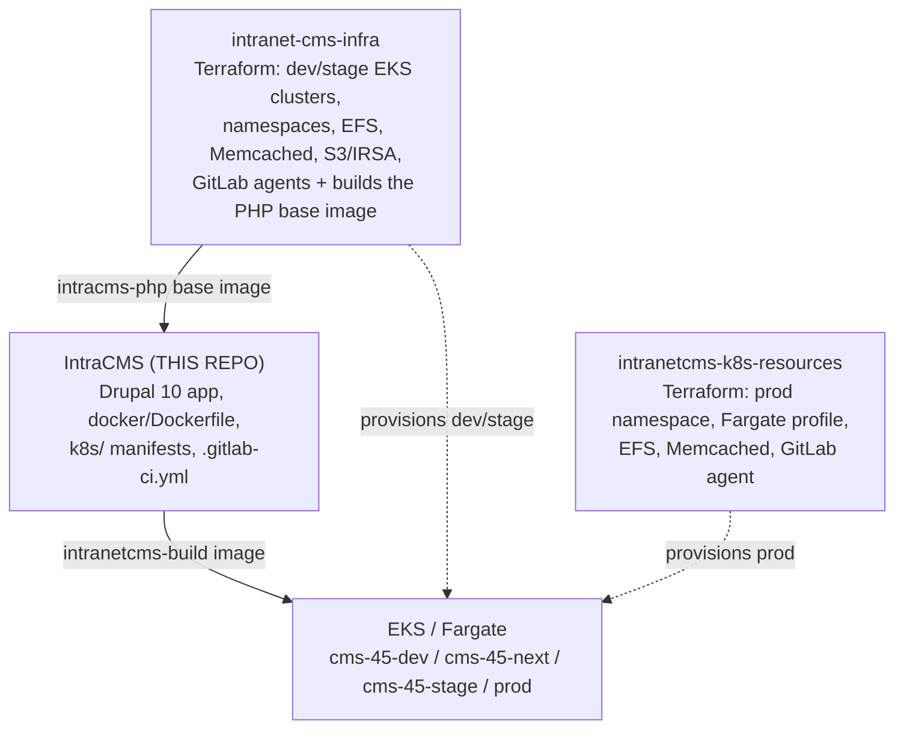
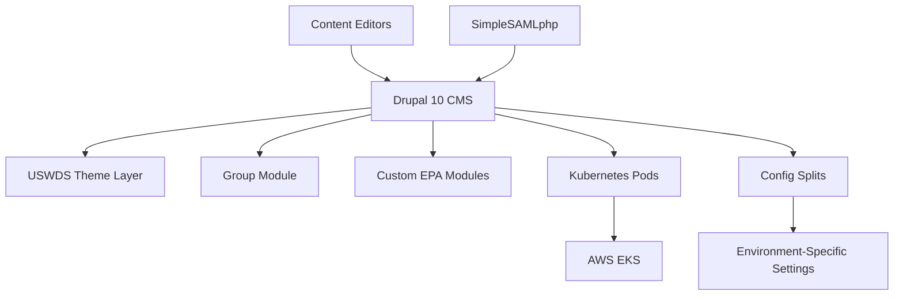

# Architecture & Developer Guide

This document provides detailed information about the repository structure, Drupal architecture, application components, and operational procedures for the EPA Intranet CMS application.

## Repository Overview

This is the EPA IntracMS repository - a Drupal 10 intranet site based on the U.S. Web Design System (USWDS). It provides a comprehensive content management system for EPA's internal communications and collaboration needs.

**Key Technologies**: Drupal 10.4.1, PHP 8.3, USWDS Base Theme, Lightning Distribution, SimpleSAMLphp, deployed on AWS EKS with Fargate.

## Related Repositories

The IntraCMS platform spans several GitLab-side repositories: this repo builds
and deploys the Drupal application, while other repos provision the AWS/EKS
infrastructure and the per-environment Kubernetes resources it runs on.

### Repository Relationship



**Repositories at a glance:**
- **IntraCMS** (this repo; GitHub source mirrored to GitLab `intranet-cms/intracms`) - Drupal 10 application, container build (`docker/Dockerfile`), Kubernetes manifests (`k8s/`), and CI/CD pipeline (`.gitlab-ci.yml`).
- **intranet-cms-infra** - Terraform for shared dev/stage EKS infrastructure (clusters, the `cms-45-dev`/`cms-45-next`/`cms-45-stage` namespaces, EFS, ElastiCache Memcached, S3 + IRSA, GitLab Kubernetes agents) and the build of the shared PHP 8.3 base image (`intracms-php`).
- **intranetcms-k8s-resources** - Terraform for the production environment: namespace, Fargate profile, EFS volume, Memcached cluster, and the production GitLab agent (runner tag `intranetcms-prod-runner`).
- **intracms-infra-dev** and **cms-k8s-stg-resources** (GitLab projects) - host the GitLab Kubernetes agents the pipeline targets for dev/dev10 and stage respectively (see Integration Points below).

### Infrastructure Repository (intranet-cms-infra)
**Location**: `~/Repositories/intranet-cms-infra`

**What it provides**:
- EKS cluster `cms-shared-dev00` (primary; hosts the `cms-45-dev` and `cms-45-next` namespaces); a secondary `cms-shared-dev01` cluster is defined in Terraform but currently disabled
- Kubernetes namespaces: `cms-45-dev`, `cms-45-next`, `cms-45-stage`
- AWS S3 bucket: `intranet-cms-dev` with IAM roles for pod access (IRSA)
- EFS file systems with access points for Drupal files
- ElastiCache Memcached cluster for Drupal caching
- GitLab Kubernetes agents for CI/CD deployment
- PHP 8.3 base container image with NGINX

### Application Repository (IntraCMS)
**Location**: `~/Repositories/IntraCMS` (THIS REPOSITORY)

**What it contains**:
- Drupal 10.4.1 application code and configuration
- Custom EPA modules (epa_core, epa_media, epa_wysiwyg, etc.)
- Custom EPA themes (epa_intranet, epa_intranet_2)
- Kubernetes deployment manifests in `k8s/` directory
- Container build configuration in `docker/` directory
- Configuration management in `config/` directory

### Production Resources Repository (intranetcms-k8s-resources)
**Location**: `~/Repositories/intranetcms-k8s-resources`

**What it provides** (Terraform, applied on its own `main` branch via the `intranetcms-prod-runner`):
- The production Kubernetes namespace and its Fargate profile (`cms-45-prd-ns`)
- A production EFS file system and `ReadWriteMany` PersistentVolume/PVC for Drupal's `/public` data
- A production ElastiCache Memcached cluster (`intranetcms-prod`), with endpoints optionally published to SSM
- The production GitLab Kubernetes agent used to deploy into the prod namespace

Note: production is provisioned here but is not deployed by this repo's pipeline (which targets dev/dev10/stage only). Production application rollout is handled separately.

### Integration Points

1. **Deployment Targets**:
   - This repo deploys to namespaces created by infrastructure repo
   - `dev-container` branch → `cms-45-dev` namespace
   - `dev-container-10` branch → `cms-45-next` namespace
   - `stage-container-1` branch → `cms-45-stage` namespace

2. **GitLab Agents**:
   - CI/CD selects a GitLab-managed Kubernetes agent per environment (agents are registered by the infra/resources projects, not this repo)
   - Dev/Dev10: `kubectl config use-context intranet-cms/intracms-infra-dev:intranetcms-dev-k8s-agent`
   - Stage: `kubectl config use-context intranet-cms/cms-k8s-stg-resources:intranetcms-stage-k8s-agent`
   - Prod (managed outside this pipeline): agent registered by `intranetcms-k8s-resources`

3. **Container Images**:
   - Infrastructure provides: `registry.epa.gov/intranet-cms/intracms-infra/intracms-php` (PHP base)
   - This repo builds: `registry.epa.gov/intranet-cms/intracms/intranetcms-build` (Drupal app)

4. **Storage**:
   - Drupal files mount EFS volumes provided by infrastructure (PVC: `intranetcms-efs-pvc`)
   - Drupal file storage uses S3 bucket with IRSA service account `oms-shell-sa`
   - Mount point: `/public` for Drupal public files

5. **Caching**:
   - Memcached clusters are provisioned by the infra repos (dev/stage in `intranet-cms-infra`, prod in `intranetcms-k8s-resources`)
   - Endpoints are published to AWS SSM Parameter Store: dev under `/intranetcms/dev/endpoints/memcached`, prod under `/echs/intranetcms/prod/endpoints/memcached`
   - The Memcache module is configured in Drupal's `settings.php`/`settings.local.php`, which are mounted at runtime from the EFS `/public` volume (see the Dockerfile symlinks) rather than baked into the image

6. **Networking**:
   - NGINX ingress controllers provisioned by infrastructure
   - This repo defines ingress rules in `k8s/intranetcms.yml`, `k8s/intranetcms-stage.yml`
   - URLs: `dev.intranetcms-dev.aws.epa.gov`, `stage.intranetcms-stage.aws.epa.gov`

### When to Work in Each Repository

**Work in intranet-cms-infra when**:
- Scaling cluster capacity or changing instance types
- Adding new AWS services (RDS, ElastiCache, etc.)
- Modifying IAM permissions or security groups
- Changing namespace quotas or Fargate profiles
- Updating base PHP/NGINX configuration
- Adding new environments or clusters

**Work in IntraCMS (this repo) when**:
- Updating Drupal core, modules, or themes
- Developing custom EPA functionality
- Changing site configuration or content types
- Modifying deployment replicas or resource requests
- Updating application environment variables
- Working on Drupal features, content, or design

**Work in intranetcms-k8s-resources when**:
- Changing the production namespace, Fargate profile, EFS, or Memcached
- Rotating or reconfiguring the production GitLab Kubernetes agent

## Development Environment Setup

### Prerequisites
- DDEV installed (recommended) or PHP 8.3, Composer 2.x, MySQL/MariaDB
- Git and Git Bash (Windows)
- Docker for containerized development

### DDEV Setup (Recommended)
```bash
# Clone repository
git clone https://github.com/USEPA/IntraCMS.git
cd IntraCMS

# Configure DDEV
ddev config --project-type=drupal9 --docroot=docroot --create-docroot
ddev start

# Install dependencies and site
ddev composer install
ddev composer site-install

# Launch site
ddev launch
```

### Manual Configuration for DDEV
Update `.ddev/config.yaml`:
```yaml
docroot: docroot
php_version: "8.3"
composer_version: "2"
```

## Common Development Commands

### Site Installation and Setup
```bash
# Full site installation (automated)
ddev composer site-install

# Manual site installation steps
ddev drush site-install standard -n --ansi
ddev drush entity:delete shortcut -y
ddev drush cset system.site uuid a20f8b2d-8c57-4965-bb1c-d142c5b66431 -y
ddev drush cr
ddev drush en config_split -y
ddev drush cim -y
```

### Configuration Management
```bash
# Export configuration
ddev drush config:export
# or
ddev drush cex

# Import configuration
ddev drush config:import
# or
ddev drush cim

# Preview configuration changes
ddev drush config:import --preview
```

### Database Operations
```bash
# Clear cache
ddev drush cr

# Update database
ddev drush updb -y

# Check status
ddev drush status
```

### Development Tools
```bash
# Install Drush (if needed)
ddev composer require drush/drush

# Enable development modules
ddev drush en devel -y

# Reset user password
ddev drush upwd admin --password="admin"
```

### Container Development
```bash
# Build container image
docker build -f docker/Dockerfile -t intracms:local .

# Clean up containers and volumes
docker system prune -f
docker volume prune -f
```

## High-Level Architecture & Structure

### Core Technology Stack
- **Drupal 10.4.1** - Content management system
- **USWDS Base Theme** - U.S. Web Design System compliance
- **Lightning Distribution** - Accelerated Drupal development
- **Group Module** - Content and user segmentation
- **Kubernetes** - Container orchestration on AWS EKS
- **SimpleSAMLphp** - Single Sign-On authentication

### Directory Structure
```
intracms/
├── config/                 # Configuration management
│   ├── sync/              # Base configurations  
│   ├── dev/               # Development overrides
│   ├── staging/           # Staging overrides
│   └── production/        # Production overrides
├── docker/                # Container configuration
├── docroot/               # Drupal web root
│   ├── modules/custom/    # Custom EPA modules
│   ├── themes/custom/     # Custom EPA themes
│   └── sites/default/     # Site configuration
├── k8s/                   # Kubernetes manifests
├── patches/               # Composer patches
└── post_deployment_files/ # Deployment scripts
```

### Custom Modules
- **epa_core** - Core EPA functionality
- **epa_media** - Media management enhancements
- **epa_wysiwyg** - WYSIWYG editor customizations
- **group_media_context** - Group-aware media handling
- **content_migrations** - Data migration utilities
- **webform_custom_submissions** - Enhanced webform handling

### Custom Themes
- **epa_intranet** - Primary EPA intranet theme (USWDS-based)
- **epa_intranet_2** - Secondary theme variant

### Architecture Flow


## Key Technologies & Integrations

### Authentication
- **SimpleSAMLphp** for SSO integration with EPA identity systems
- Configuration managed through mounted volumes in containers

### Content Management
- **Paragraphs** for structured content creation
- **Entity Browser** for media selection
- **Webforms** for data collection
- **Group module** for content organization and access control

### Media Management
- Custom EPA media modules for enhanced file handling
- Image cropping and optimization
- Video embedding capabilities

### Notable Contrib Modules
- **Lightning Core/Media/Workflow** - Drupal distribution components
- **USWDS** - U.S. Web Design System integration
- **Paragraphs** - Structured content components
- **Group** - Multi-site content organization
- **Webform** - Form builder and submissions
- **FullCalendar** - Event management
- **Search API** - Enhanced search functionality

### Critical Patches Applied
The system applies numerous patches for Drupal 10 compatibility and enhanced functionality:
- Group module enhancements for content transitions and media library access
- CKEditor 5 integration fixes
- Lightning distribution compatibility updates
- Performance optimizations for entity queries

## Container Deployment & Kubernetes

### Image Build Process
The `build:image` job builds the app image with Kaniko and pushes it as
`intranetcms-build:<short-sha>`. Layer caching is enabled so unchanged layers -
in particular the Composer dependency layer - are restored from a registry cache
instead of rebuilt. The Dockerfile copies `composer.json`/`composer.lock` and
`patches/` and runs `composer install` *before* copying the rest of the source,
so that dependency layer only rebuilds when dependencies actually change.
```bash
/kaniko/executor \
  --context $CI_PROJECT_DIR \
  --dockerfile $CI_PROJECT_DIR/docker/Dockerfile \
  --build-arg PHP_BASE_TAG=${PHP_BASE_TAG:-latest} \
  --cache=true \
  --cache-repo=$CI_REGISTRY_IMAGE/cache \
  --cache-ttl=336h \
  --cache-copy-layers=true \
  --destination $CI_REGISTRY_IMAGE/intranetcms-build:$CI_COMMIT_SHORT_SHA
```
The base PHP image tag is controlled by the `PHP_BASE_TAG` build arg (default
`latest`); set a `PHP_BASE_TAG` CI/CD variable to pin an immutable base image.

### Kubernetes Deployment
The application deploys across multiple environments:
- **dev** - Development environment
- **dev10** - Drupal 10 testing environment  
- **stage** - Staging environment
- **prod** - Production environment (`cms-45-prod`, host `prod.intranetcms-prod.aws.epa.gov`), released by manual promotion from the stage pipeline

### Key Kubernetes Resources
```yaml
# Deployment with Fargate compute
apiVersion: apps/v1
kind: Deployment
metadata:
  name: intranetcms
  annotations:
    eks.amazonaws.com/compute-type: fargate
```

### Useful kubectl Commands
```bash
# Check deployment status
kubectl get pods -n cms-45-dev

# View logs
kubectl logs deployment/intranetcms -n cms-45-dev

# Execute drush commands
kubectl exec -it deployment/intranetcms -n cms-45-dev -- drush status
```

### Post-Deployment Tasks
Post-deploy Drush runs as a Kubernetes **Job** (`k8s/drush.yml`, `k8s/drush-dev10.yml`),
launched by the `postdeploy:<env>` CI job. The CI job waits for the Job to finish,
streams its logs, and fails the pipeline if Drush fails or times out (the Job has
`backoffLimit: 0` and `activeDeadlineSeconds: 1800`).

The Job wraps the update in a fail-closed maintenance window: it enables
maintenance mode, runs the updates, then lifts maintenance only if every step
succeeded. If any step fails, the site stays in maintenance and the pipeline fails.
```bash
# Enable maintenance mode (bootstrap-free), then update, then lift it:
drush @intra sql:query "REPLACE INTO key_value (collection, name, value) VALUES ('state', 'system.maintenance_mode', 'b:1;')" \
  && drush @intra updb --yes \
  && drush @intra cim --yes \
  && drush @intra cr \
  && drush @intra sql:query "DELETE FROM key_value WHERE collection = 'state' AND name = 'system.maintenance_mode'"
```

## GitLab CI/CD Pipeline

### Pipeline Stages
The pipeline uses a `needs:` DAG (not strict stage ordering), so a deploy starts
as soon as the image is built rather than waiting for the security scan:

1. **build** (`build:image`) - build + push the app image with Kaniko (cached)
2. **scan** (`Prisma Scan`) - Prisma Cloud image scan; runs in parallel with the
   deploy and is non-blocking (`allow_failure: true`)
3. **deploy** (`deploy:dev` / `deploy:dev10` / `deploy:stage`) - `kubectl apply`
   the manifests to the environment's namespace
4. **post-deploy** (`postdeploy:dev` / `postdeploy:dev10` / `postdeploy:stage`) -
   run the verified Drush Job (see Post-Deployment Tasks)
5. **prod-deploy** (`deploy:prod`) - manual promotion of the stage-validated
   image to production (see Production Promotion below)
6. **prod-post-deploy** (`postdeploy:prod`) - run the verified Drush Job in prod
7. **dast** - Dynamic Application Security Testing (ZAP), manual

Each branch runs only the jobs whose `rules:` match it (see Branch Strategy).

### Production Promotion
Production uses an **image-promotion** model rather than a prod branch. `deploy:prod`
is a manual job that `needs: postdeploy:stage`, so it only becomes available after
stage (including its Drush Job) fully succeeds. When played, it deploys the exact
same `intranetcms-build:<sha>` image that stage validated into the `cms-45-prod`
namespace via the production GitLab agent, then `postdeploy:prod` runs the same
verified Drush Job. Because the artifact and Drush steps are identical to stage and
only environment config differs, a green stage is a strong predictor of prod.
After stage passes, the pipeline shows "blocked" - that is the ready-to-promote state.

### Branch Strategy
- `dev-container` → Development deployment
- `stage-container-1` → Staging deployment  
- `dev-container-10` → Drupal 10 development

### Security Scanning
- **Prisma Cloud** integration for container vulnerability assessment
- **DAST** (Dynamic Application Security Testing) with ZAP scanner
- Automated security checks in CI/CD pipeline

### Environment Variables
```yaml
DAST_WEBSITE: "https://stage.intranetcms-stage.aws.epa.gov/"
WEB_HTTPS: "false"
WEB_HTTPS_ONLY: "false"
```

## Configuration Management Strategy

### Config Split Implementation
The site uses Drupal's Configuration Split module to manage environment-specific settings:
- **Base config** in `config/sync/`
- **Development overrides** in `config/dev/`
- **Staging overrides** in `config/staging/`
- **Production overrides** in `config/production/`

### Site UUID
Fixed UUID for configuration synchronization:
```bash
a20f8b2d-8c57-4965-bb1c-d142c5b66431
```

## Development Workflow

### Feature Development Process
1. Create feature branch from `development`
2. Set up local environment with DDEV
3. Make changes and test locally
4. Export configuration changes: `ddev drush cex`
5. Commit and push changes
6. Create pull request to `development`
7. Deploy to development environment for testing

### Code Standards
- Follow Drupal coding standards
- Custom modules use EPA namespace
- Themes extend USWDS base theme
- All configuration managed through code

## Troubleshooting

### Common Issues
- **Config Import Errors**: Ensure site UUID matches: `drush config-set "system.site" uuid "a20f8b2d-8c57-4965-bb1c-d142c5b66431"`
- **File Permissions**: Set temp directory: `$settings['file_temp_path'] = 'sites/default/files/temp';`
- **Memory Issues**: Increase PHP memory limit in php.ini: `memory_limit = 2048M`

### DDEV Troubleshooting  
- Port conflicts: Configure alternative ports in `.ddev/config.yaml`
- Container issues: `ddev restart` or `ddev poweroff && ddev start`
- Database issues: `ddev drush sql:sync` from working environment

## Additional Resources

- **Installation Guide**: [INSTALLATION.md](INSTALLATION.md)
- **Contributing Guide**: [contributing.md](contributing.md)
- **System Requirements**: [system-requirements.md](system-requirements.md)
- **EPA Open Source Guidance**: https://www.epa.gov/developers/open-source-software-and-epa-code-repository-requirements